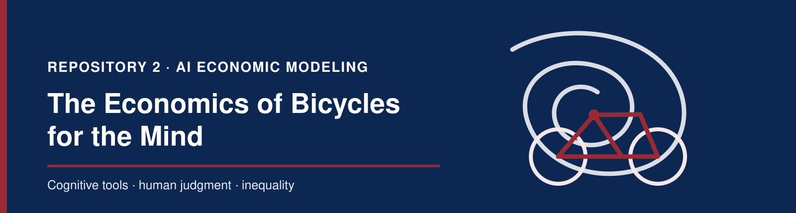

<p align="center">
  
</p>

<p align="center">
  <a href="https://www.nber.org/papers/w34034"></a>
  <a href="https://doi.org/10.3386/w34034"></a>
  <a href="presentation.pdf"></a>
  <a href="presentation.tex"></a>
  <a href="LICENSE"></a>
</p>

<p align="center">
  
  
  
</p>

This repository studies Ajay Agrawal, Joshua Gans, and Avi Goldfarb's *The
Economics of Bicycles for the Mind* (2025), an **unrefereed NBER working paper**
about computers and AI as cognitive tools.

## What question does the paper answer?

**When a cognitive tool makes implementation easier, how do human effort,
productivity, the returns to different abilities, and inequality change?**

The paper formalizes one mechanism: a cognitive tool is a **substitute for human
implementation effort at the margin**, while judgment determines how much value
the agent can obtain from the tool.

- **Implementation skill** $s$ makes effort more effective.
- **Payoff judgment** $\alpha$ is the ability to extract value from a successful
  implementation.
- **Opportunity judgment** $\gamma(t)$ is the probability of finding another
  opportunity to improve the task.

## The agent's problem

Conditional on finding an opportunity in period $t$, the agent chooses effort
$e_t$ to maximize expected improvement value net of effort cost:

$$
e_t^*(\theta)\in\arg\max_{e_t\geq 0}
\left\{p(se_t;\theta)\alpha\Delta-c(e_t;\theta)\right\}.
$$

Here, $\theta$ measures tool quality, $\Delta>0$ is the value of a successful
improvement, $p(se_t;\theta)\in[0,1]$ is its success probability, and
$c(e_t;\theta)$ is effort cost. The model assumes that $p$ is increasing and
weakly concave in skill-augmented effort and that $c$ is increasing and weakly
convex. A cognitive tool weakly raises $p$, weakly lowers $c$, and strictly
reduces the marginal success-to-cost ratio $p'/c'$ as $\theta$ rises.

For an interior optimum, effort satisfies

$$
p'(se_t^*(\theta);\theta)s\alpha\Delta
=c'(e_t^*(\theta);\theta).
$$

## Propositions 1 and 2

**Proposition 1 — more value with less effort.** Under the cognitive-tool
definition and a well-defined interior optimum, moving from $\theta=0$ to
$\theta=1$ lowers effort in every period, makes optimal effort time-invariant,
and raises expected task value:

$$
e_t^*(1)<e_t^*(0),\qquad e_t^*(\theta)=e^*(\theta),\qquad
V_0(1)>V_0(0).
$$

**Proposition 2 — what drives adoption value.** Define the discounted
opportunity multiplier

$$
\Gamma=\sum_{t=0}^{\infty}
\left(\prod_{i=0}^{t}\gamma(i)\right)\delta^t.
$$

Then the gain from adopting the tool is

$$
V_0(1)-V_0(0)
=\Gamma\left[M(e^*(1);1)-M(e^*(0);0)\right]>0.
$$

Opportunity judgment scales the entire gain. Payoff judgment complements the
tool **if and only if** realized success is weakly higher with it,
$p(se^*(1);1)\geq p(se^*(0);0)$. Implementation skill lowers adoption value
under the paper's tool-skill substitutability condition $p_{s\theta}<0$, and
earlier opportunities receive greater discounted weight in the paper's timing
result.

## Proposition 3 — the conditional U-shape

For the inequality result, the paper specializes the model to

$$
p(se;\theta)=\sqrt{se+\theta},\qquad c(e)=e,\qquad
\gamma(0)=\gamma_0,\quad \gamma(t)=\gamma\ \text{for }t>0.
$$

It treats $\theta\geq0$ as continuous, requires $\delta\gamma<1$, and assumes
that $\alpha,\gamma_0,\gamma,s$ are mutually independent with positive support,
means $\mu_i$, variances $\sigma_i^2$, and $\mu_i>3\sigma_i$. The closed form is
valid over the range in which every agent's solution is interior:

$$
e^*(\theta)=\frac{\alpha^2\Delta^2s}{4}-\frac{\theta}{s}>0
\quad\Longleftrightarrow\quad
\theta<\frac{\alpha^2\Delta^2s^2}{4}.
$$

With $\Gamma=\gamma_0/(1-\delta\gamma)$, continuation value is

$$
V(\theta)=\Gamma\left(\frac{\alpha^2\Delta^2s}{4}+\frac{\theta}{s}\right),
\qquad
\frac{\partial E[V(\theta)]}{\partial\theta}
=E[\Gamma]E[1/s]>0.
$$

The U-shape is in the **cross-sectional variance of continuation value
$V(\theta)$**, interpreted as wage variance, **with respect to tool quality
$\theta$**. It is not unconditional. The initial decline requires

$$
\frac{E[\Gamma^2]}{E[\Gamma]^2}<\mu_sE[1/s]. \tag{30}
$$

If condition (30) holds and $\operatorname{Var}(\Gamma/s)>0$, the variance is
strictly convex and has the unique minimum

$$
\theta^*=\frac{\Delta^2(\mu_\alpha^2+\sigma_\alpha^2)}{4}
\frac{E[\Gamma]^2\mu_sE[1/s]-E[\Gamma^2]}
{\operatorname{Var}(\Gamma/s)}>0.
$$

The U-shape is valid for the constrained model only if $\theta^*$ lies inside
the common interior range shown above; otherwise the zero-effort corner must be
solved instead of extrapolating the interior formula.

> **Variance audit.** Condition (30) proves that wage variance falls at
> $\theta=0$ and that the interior quadratic eventually turns upward. It does
> **not** prove the paper's displayed claim that the slope is already positive
> at $\theta=1$; that statement additionally requires $\theta^*<1$ and an
> interior solution at that endpoint.

The variance of the **individual adoption benefit** is a different object. For
$D_i(\theta)=V_i(\theta)-V_i(0)=\theta\Gamma_i/s_i$,

$$
\operatorname{Var}[D(\theta)]
=\theta^2\operatorname{Var}(\Gamma/s),
$$

which increases monotonically for $\theta>0$ whenever $\Gamma/s$ is
heterogeneous.

*Intuition in one sentence:* inverse skill bias initially compresses wage
dispersion because the tool boost is $\theta/s$, but heterogeneous opportunity
judgment can eventually amplify those gains enough to widen dispersion again.

## Repository structure

```text
.
├── assets/
│   └── header.svg          # README banner
├── paper/
│   ├── README.md           # citation and official download links
│   └── w34034.pdf          # local source paper (git-ignored)
├── presentation.tex        # four-frame Beamer source
├── presentation.pdf        # compiled slides
├── README.md               # model and results overview
├── LICENSE
└── .gitignore
```

## Citation

> Agrawal, A. K., Gans, J. S., & Goldfarb, A. (2025). *The Economics of
> Bicycles for the Mind*. NBER Working Paper No. 34034.
> <https://doi.org/10.3386/w34034>
