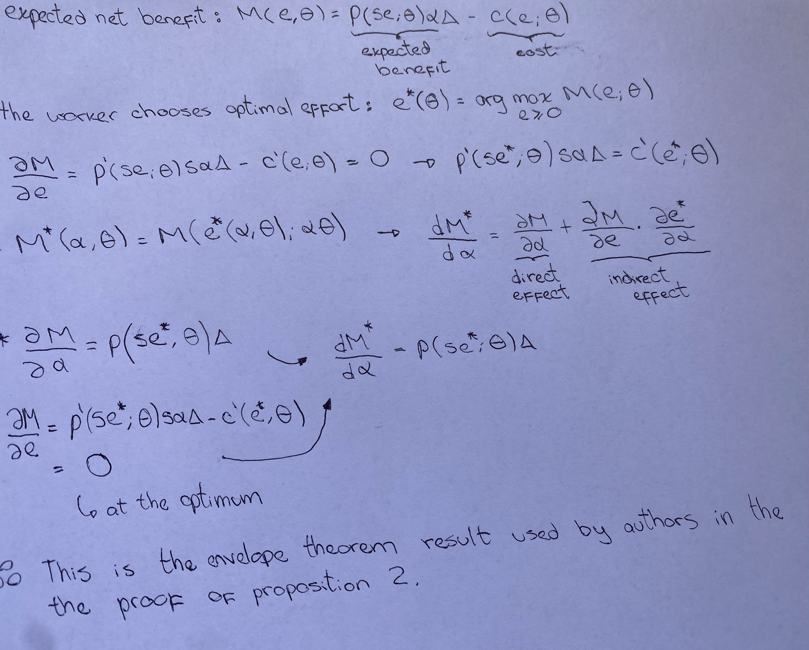

<p align="center">
  
</p>

<p align="center">
  <a href="https://www.nber.org/papers/w34034"></a>
  <a href="https://doi.org/10.3386/w34034"></a>
  <a href="presentation.pdf"></a>
  <a href="extra/presentation-long.pdf"></a>
  <a href="extensions/extensions.pdf"></a>
</p>

<p align="center">
  <a href="presentation.pdf"></a>
  <a href="extra/presentation-long.pdf"></a>
  <a href="sim.py"></a>
  <a href="lean/README.md"></a>
  <a href="LICENSE"></a>
</p>

<p align="center">
  
  
  
  
  
  
  
</p>

## Presentations

<table>
  <tr>
    <td width="33%" align="center">
      <strong>Short presentation</strong><br>
      <sub>5 frames · main argument, variance audit, and hand check</sub><br><br>
      <a href="presentation.pdf"></a>
    </td>
    <td width="34%" align="center">
      <strong>Extended presentation</strong><br>
      <sub>26 frames · complete theoretical development</sub><br><br>
      <a href="extra/presentation-long.pdf"></a>
    </td>
    <td width="33%" align="center">
      <strong>Technical extensions</strong><br>
      <sub>Full derivations, qualifications, and robustness checks</sub><br><br>
      <a href="extensions/extensions.pdf"></a>
    </td>
  </tr>
</table>

This repository studies Ajay Agrawal, Joshua Gans, and Avi Goldfarb's *The
Economics of Bicycles for the Mind* (2025).

## What question does the paper answer?

**When a cognitive tool makes implementation easier, how do effort,
productivity, the returns to different human abilities, and inequality change?**

The single mechanism is that the tool **substitutes for human implementation
effort at the margin**, while judgment determines how much value the agent can
obtain from it:

- **Implementation skill** makes effort more effective.
- **Payoff judgment** determines whether successful implementation creates value.
- **Opportunity judgment** determines whether another improvement opportunity is found.

## The agent's problem

Conditional on an opportunity, the agent chooses **non-negative effort** to
maximize the expected value of a successful improvement minus effort cost.
Success depends on implementation skill, effort, payoff judgment, tool quality,
and the value of the improvement. Success is increasing and weakly concave in
skill-adjusted effort, while cost is increasing and weakly convex. A cognitive
tool raises success and/or lowers cost while reducing the marginal
success-to-cost ratio. At an interior solution, marginal expected benefit
equals marginal effort cost.

## Propositions 1 and 2

**Proposition 1.** Moving from no tool to the tool lowers optimal effort in
every period, makes effort time-invariant, and raises expected task value.

**Proposition 2.** The adoption gain is the per-opportunity productivity gain
multiplied by the discounted number and timing of future opportunities.

Opportunity judgment scales the gain. Payoff judgment complements adoption
only when realized success is weakly higher with the tool. The paper argues
that implementation skill reduces adoption value under tool-skill
substitutability; the [technical extension](extensions/extensions.pdf) records
two caveats to the general statement.

## Proposition 3: the conditional U-shape

The inequality result uses a square-root success technology, linear effort
cost, and a geometric opportunity process. Tool quality is continuous and
non-negative, and discounted opportunity persistence must be below one. Payoff
judgment, initial opportunity judgment, subsequent opportunity judgment, and
implementation skill must be mutually independent, have positive support, and
have means greater than three standard deviations.

The U-shape is in the **cross-sectional variance of total continuation value**,
interpreted as wages, **with respect to continuous tool quality**. It applies
only over a common range in which every worker chooses positive interior
effort. It also requires the paper's condition (30)—opportunity heterogeneity
must be small relative to inverse-skill heterogeneity—and positive variation
in the opportunity multiplier divided by skill.

Under these conditions the variance slope is linear, initially negative, and
crosses zero once at a positive turning point. The paper's stronger displayed
claim that the slope is already positive when tool quality equals one needs the
additional condition that the turning point lies below one.

The variance of the **individual adoption benefit** is a different object. For
each worker, the gain equals tool quality times the opportunity multiplier
divided by skill. Its cross-sectional variance rises with the square of tool
quality, so it increases monotonically whenever that ratio is heterogeneous.

*Intuition:* inverse skill bias initially compresses wage dispersion because
the tool boost is larger for lower-skill workers, but heterogeneous opportunity
judgment can eventually amplify those gains enough to widen dispersion again.

## Machine-checked audit

The [`lean/`](lean/) appendix verifies the specialized interior optimizer,
first-order condition, global uniqueness, variance derivative, condition (30),
turning point, conditional U-shape, endpoint correction, and monotonic
individual-benefit variance in Lean 4. The proof project uses exact real
arithmetic and rejects unfinished proofs. It complements `sim.py`: Lean checks
the general algebraic implications, while Python retains the
distribution-specific numerical counterexample and figures.

## Handwritten derivation

The photo shows my handwritten envelope-theorem derivation separating the direct and indirect effects and using the effort first-order condition, as in Proposition 2.

<p align="center">
  <a href="hand/envelope-theorem-derivation-upright.png"></a>
</p>

## Repository structure

```text
.
├── assets/                     # README banner and shared Beamer theme
├── extra/
│   ├── figures/                # Reproducible variance comparison
│   ├── presentation-long.tex   # 26-frame technical deck
│   └── presentation-long.pdf
├── paper/
│   └── THE ECONOMICS OF BICYCLES FOR THE MIND.pdf
│                               # Source paper included in the repository
├── extensions/
│   ├── extensions.tex          # Full derivations and audit
│   └── extensions.pdf
├── hand/
│   ├── envelope-theorem-derivation.png          # Original photograph
│   └── envelope-theorem-derivation-upright.png  # Upright README copy
├── lean/                       # Lean 4 and Mathlib proof audit
│   ├── Agrawal/
│   │   ├── Optimization.lean  # Interior optimizer and probability clash
│   │   └── Variance.lean      # U-shape and endpoint correction
│   ├── Agrawal.lean           # Imports the complete formal appendix
│   ├── README.md               # Proof map and formalization boundary
│   ├── lake-manifest.json      # Locked dependency graph
│   ├── lakefile.toml
│   └── lean-toolchain
├── presentation.tex            # Five-frame oral-exam deck
├── presentation.pdf
├── prompts.md                  # Shared-chat link and this task transcript
├── sim.py                      # Deterministic SymPy and exact-moment checks
└── requirements.txt
```

## Reproduce the audit

```bash
python3 -m pip install -r requirements.txt
python3 sim.py
cd lean && lake exe cache get && lake build --wfail && cd ..
lualatex presentation.tex
cd extra && lualatex presentation-long.tex
cd ../extensions && lualatex extensions.tex
```

## Citation

> Agrawal, A. K., Gans, J. S., & Goldfarb, A. (2025). *The Economics of
> Bicycles for the Mind*. NBER Working Paper No. 34034.
> <https://doi.org/10.3386/w34034>
